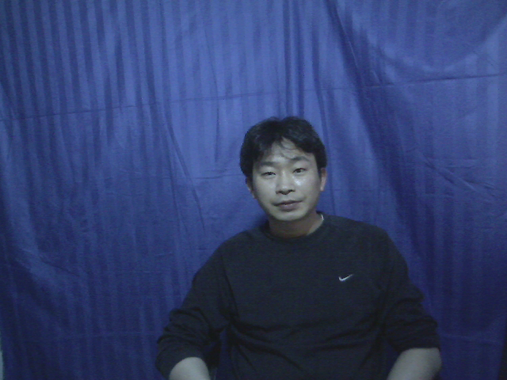
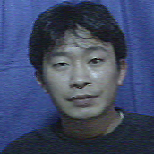
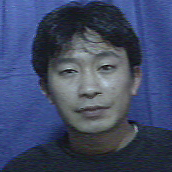
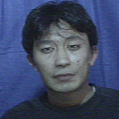

# You after Taking Drugs

See What You’d Look Like as A Drug Addict

## Get Started

1. Download the dlib model and put it in the model folder. [link](http://dlib.net/files/shape_predictor_68_face_landmarks.dat.bz2)

2. `python face_distort.py` run the demo and see the output

## Results Preview

Input:

Output:

## System Framework

## Software That Use This Algorithm

From `宁波思伟教育科技有限公司`

## Reference

[ahxc:face_morpher](https://github.com/ahxc/face_morpher)

[Interactive_Image_Warping](http://www.gson.org/thesis/warping-thesis.pdf)

Thanks to `宁波思伟教育科技有限公司` for sponsoring this project!
